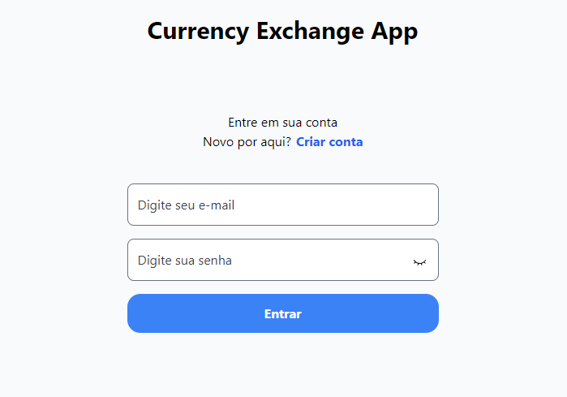
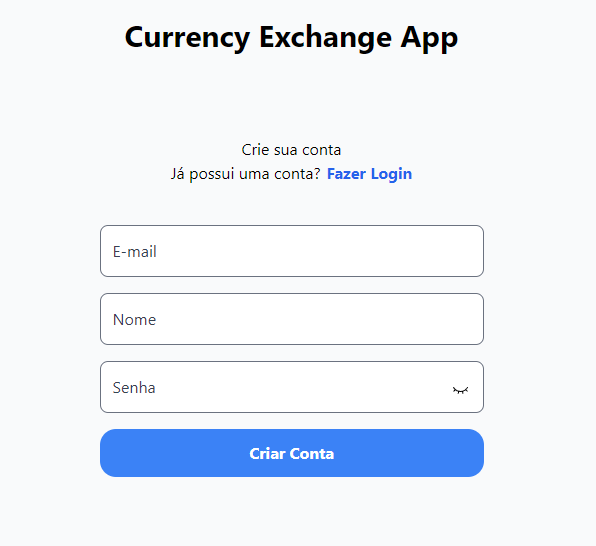
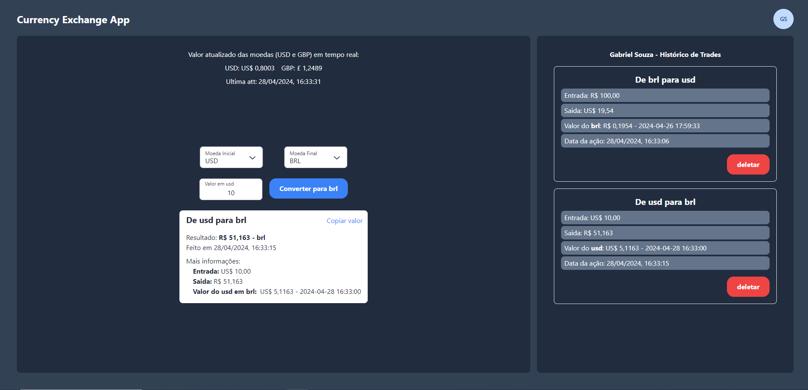
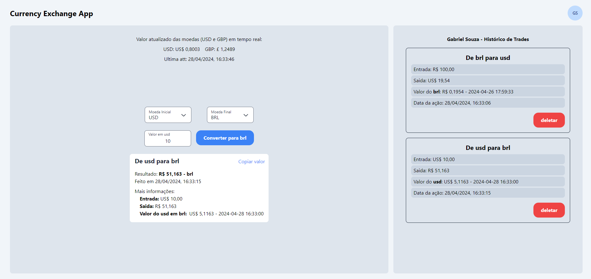

# Currency Exchange (web and api)

## How to run:

### API [about](https://github.com/SouzaGabriel26/currency-exchange/tree/main/api#readme)

> install api dependencies

```bash
  cd api
```

```bash
  yarn
```

> Create .env file based on .env.development

> Starting docker container based on docker-compose file

```bash
  yarn services:up
```

> Run prisma migrations

```bash
  yarn prisma migrate dev
```

> Run api

```bash
  yarn dev
```

### WEB

> Open another terminal and return to the root folder

```bash
  cd ..
```

> install web dependencies

```bash
  cd web
```

```bash
  yarn
```

> Create a .env based on .env.development

> Run web

```bash
  yarn dev
```

## About

Currency exchange app that allows users to make trades queries and see their historic.
The curencies: `USD` and `GBP` are updated in every 15s on the screen. It uses `websocket`

## 📷 Image preview

- Login:

  

- Register:

  

- Dashboard:

  

- Dashboard Light:

  
